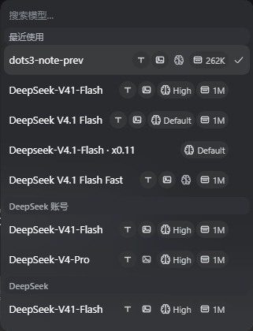
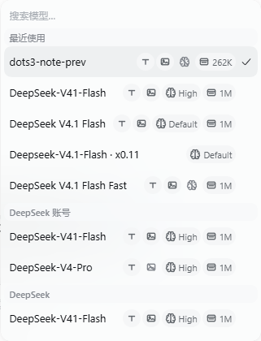
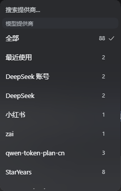
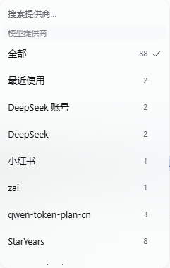
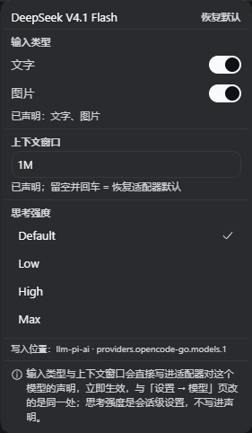
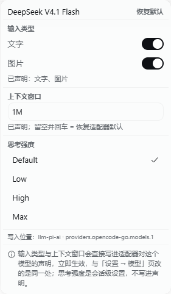
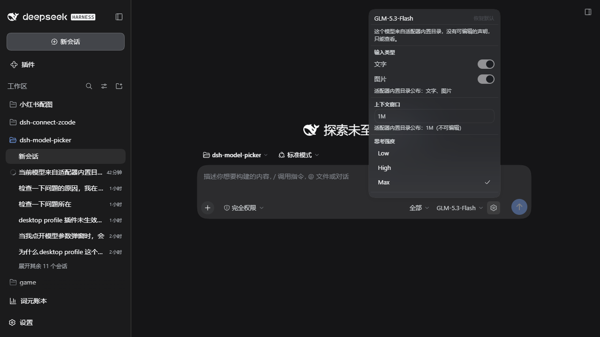

# dsh-rabbit-model-picker

DSH 输入框模型选择器的外部替换件。把「Model / Effort 两格 → 各自二级面板」换成**一层列表**——
搜索常驻、每行用只读徽章陈述事实（文字 / 图片 / 思考强度 / 上下文窗口），
触发器左侧加一个提供商 chip，菜单里还有「最近使用」视图。`/model` 与 Host 侧逻辑不动。

设计依据与逐条契约见 [DESIGN.md](DESIGN.md)。

## 特性

- **不改 DSH 安装目录**：profile 依赖 + 一个 Loader 行即可。
- **完全可回退**：删掉那一行（或把 `priority` 改成 `> 0`）即恢复原控件。
- **不复制状态**：目录 / 选择 / pending / 错误全部读同一个 per-session store，任一处切换立刻同步。
- **筛选只影响视图**：提供商筛选是纯前端状态，不写 Host，`/model` 与触发器不受影响。
- **行内无控件**：徽章只说事实，点行 = 选模型；**思考强度只在齿轮参数面板里改**。
- **内置目录也照样陈述**：模型来自适配器内置目录、配置里没有声明条目时，模态与窗口从**适配器自己
  发布的目录**读（`llm/discoverModels` / 适配器自有 Remote），而不是留白或猜。
- **对比度达标**：面板文字全部过 WCAG AA，由 `npm run contrast` 逐样式量出。

## 效果

| | 深色 | 浅色 |
|---|---|---|
| 模型卡 |  |  |
| 提供商面板 |  |  |
| 参数面板 |  |  |
| 参数面板：模型来自适配器内置目录（§5.19 实测） |  | — |

| 座位行（chip · 触发器 · 齿轮） |
|---|
|  |

## 交互

| 动作 | 结果 |
|---|---|
| 点提供商 chip | 打开提供商菜单：搜索 + `全部` / `最近使用` / 各 provider（带模型计数，失败的排最后且不可选）。当前会话的 provider 行尾标「当前会话」 |
| 选「最近使用」 | 只列最近用过的模型（最多 5 条），仍按 provider 分组，排序为 recency |
| 选一个 provider | 只列它的模型，chip 显示「仅显示 {name}」；按会话记忆 |
| 点「显示全部」 | 恢复全部 provider（记忆同时清掉） |
| 点模型 chip / 某行 | 单层列表：常驻搜索 + provider 分组 + 每行四个只读事实徽章；点某行 = 切模型，点已选中的行 = 关闭 |
| 悬停某行 | `title` 给出整句事实（模型名、输入类型、强度、上下文窗口） |
| 悬停触发器 | 气泡里只有模型名；`aria-label` 仍带「推理等级 {effort}」 |
| 点齿轮 | 打开参数面板：输入类型、上下文窗口、思考强度；profile 已声明的项带小圆点标记 |
| 参数面板改输入类型 / 上下文窗口 | **真写进 Host**：改适配器对模型的声明，立即生效；底部写明写入位置 |
| 参数面板填上下文窗口 | 接受 `128K` / `1M` / `262144`；留空 = 撤掉声明回到适配器默认 |
| 参数面板点「恢复默认」 | 撤掉本 profile patch 里的声明；无声明时按钮禁用 |
| 参数面板点思考强度 | **唯一改强度的地方**：走 `directory.select()`，改完行内徽章同步 |
| 无法寻址的路由 | 面板写明原因，并**陈述适配器目录公布的事实**（可编辑的控件仍然全部禁用）；适配器什么都没公布时，对应分区整块不渲染，不画成"不支持" |
| 键盘 | `↑↓` 移高亮、`Enter` 选中；`Tab` 在 chip → 搜索 → 各行间走；`Esc` 逐层退出 |
| 问答/审批/只读子代理顶掉输入条时 | 三个弹窗一起关掉（不还焦点）。判据是座位根有没有盒子，窄布局不误关。详见 DESIGN.md §5.18 |

## 行内徽章

每行右侧四个只读徽章，顺序固定。前三个自绘于宿主 16 单位网格，思考强度用宿主 24×24 大脑，
两套网格线重均为 1.4px。

| 徽章 | 含义 | 值 |
|---|---|---|
| 文字输入 | 该模型接受文字 | 不支持时图标加斜杠、降到 quiet 色调 |
| 图片输入 | 该模型接受图片 | 同上 |
| 思考强度 | 该行生效的档位 | 档位名（无默认档位时是 `Default`）；未声明档位 → 划掉的图标 |
| 上下文窗口 | 该模型声明/默认的窗口 | 整数 + K/M（`1M` / `128K`，不出现 `1048576` 或小数） |

读取顺序就是适配器自己的顺序——**声明 → 适配器发布的目录 → 适配器的 provider 级默认**
（pi-ai 的 `entry.contextWindow ?? base?.contextWindow ?? defaultContextWindow`，
opencode-go 的 `modelInfo()` 同序），所以徽章和适配器实际用的值一致。

- **紧凑**：纯图标胶囊 22px、`Default` 60px、`1M` 41px，四枚合计约 151px；320px 卡片里模型名能分到 ~122px。详见 DESIGN §5.12。
- **不猜**：模态与窗口先读 Host 设置快照，设置里查不到的再读适配器发布的目录；两者都查不到的**不显示**，不会画成"不支持"。
- **只读**：适配器目录来的事实没有任何可写目标，参数面板里对应分区禁用并写明来源。
- **可读**：徽章条带 `title`，整句同时是行的 `aria-label`，屏幕阅读器听到的是整句而非裸数字。
- **不可交互**：用宿主 `Tag` 原语 + `aria-hidden`，点徽章 = 点该行，无隐藏行为。

## 安装

由 DSH 自己写 profile（不要手改 profile 的 `package.json` / `cordis.patch.yml`）。
在插件的「添加插件」输入框里粘贴包名即可：

```
dsh-rabbit-model-picker
```

也可以粘 GitHub 地址：

```
github:a285292107s/dsh-rabbit-model-picker
```

或写成 `https://github.com/a285292107s/dsh-rabbit-model-picker`。

这条命令：拉取/安装 → 加进 `dsh.profile.bundles` → 应用包内 `cordis.patch.yml` 的 insert 行。
返回 `application: applied` 即生效；页面刷新后新座位接管。

> ⚠ **git 安装不会构建。** `lib/` 是**提交进仓库**的产物，不是安装时生成的——pnpm 拉 git
> tarball 只搬运仓库里已有的文件，没有构建步骤。所以改了 `src/` 必须重新 `npm run build`
> 并连同 `lib/` 一起提交，否则用户装到的是旧行为（或 `lib/` 缺失时报
> `failed to import`）。`npm test` 里的 `test:fresh` 门会拦住这种漂移。
> （npm 发布走 `files` 白名单，同样只有在 `prepublishOnly` 构建后才会带上 `lib/`。）

**本机开发**用 `link:` 指向工作目录（改完 `npm run build` 刷新页面即生效）：

```
plugin_manager { action: "install_bundle", target: "C:/Users/28529/Desktop/dsh-model-picker" }
```

**回退**：`plugin_manager { action: "remove_bundle", target: "dsh-rabbit-model-picker" }`，或删掉 insert 行。

## 开发

```bash
npm install          # esbuild + typescript + @types/react
npm run build        # esbuild → lib/index.js（宿主）+ lib/client.js（客户端）
npm run typecheck    # tsc --noEmit
npm run test:fresh   # lib/ 与 src/ 是否一致（产物漂移门）
npm run selfcheck    # 静态禁令 + 座位契约 + 文案键 + 面板/触发器/筛选契约
npm run contrast     # 文字对比度门：两个主题下按真实字号判 WCAG AA
npm run test:params  # 参数寻址/容量 + 行内事实推导 + 面板文案决策的单元门
npm test             # build + test:fresh + selfcheck + contrast + test:params
```

> `lib/` 是提交进仓库的（见「安装」）。**动过 `src/` 就要把重建后的 `lib/` 一起提交**，
> `npm run test:fresh` 会在 `lib/` 与 `src/` 不一致时失败。

`npm run contrast` 需要本机装有 DSH；找不到时 `skip`。它量的是两种下层底色里较差的那种，
面板浮在哪一层都不影响结论。

浏览器端验收（页面需已用 `dsh web` 打印的 URL 完成认证）：

```bash
playwright-cli -s=verify open 'http://127.0.0.1:3080/?token=<token>'
playwright-cli -s=verify --raw run-code --filename=./scripts/_accept-anchor-loss.cjs
```

> ⚠ 改了 `src/` 后 **`location.reload()` 不够**：Loader 用 `rev` 键给 client 模块，浏览器可能返回旧 body。
> 先 `Network.setCacheDisabled` 再 reload，并在记录结论前断言 bundle 里确实有改动。
>
> ⚠ 本目录自 2026-10-02 起有 git 历史（`master` → `origin`），但早期被误删的几个验收脚本
> （`_badges-probe.cjs` / `_icons-probe.cjs` / `_verify-fixes.cjs` / `_verify-settings.cjs`）不在任何提交里，
> DESIGN.md 里对它们的引用仍是待重写的清单。

改了 `lib/client.js` 后刷新页面即可：宿主按产物哈希拼接 client 模块，重建后刷新会取到新文件。
（`lib/` 已提交进仓库——见「安装」，重建后记得连同 `src/` 一起提交。）

## 结构

```
src/index.ts               宿主半边：空 apply
src/client/index.ts        入口：inject 声明 + slots.inject → register(priority:-10)
src/client/Picker.tsx      chip + 触发器 + 齿轮 + 单层菜单
src/client/BadgeIcons.tsx  四个徽章图标 + 斜杠"不支持"变体
src/client/facts.ts        徽章词汇表（渲染层与推导层共用）
src/client/badges.ts       行内事实推导（纯函数）
src/client/capabilities.ts 适配器发布的能力目录（只读事实 + 读取策略）
src/client/format.ts       徽章专用窗口写法（整数 + K/M）
src/client/effort.ts       强度档位命名与列表
src/client/ProviderMenu.tsx provider 筛选菜单
src/client/SettingsMenu.tsx 模型参数面板
src/client/panelCopy.ts     面板文案（纯数据）
src/client/anchorLoss.ts    座位离开版面判据（纯逻辑）
src/client/params.ts        参数寻址与读写（含 revision 冲突重试）
src/client/recent.ts        最近使用（localStorage）+ 伪 provider 分桶
src/client/prefs.ts         视图偏好（localStorage）
src/client/dictionary.ts    zh/en 文案 + 本地兜底
src/client/styles.ts        注入样式表（全部走 --dsw-* 令牌）
src/client/contract.ts      外部结构类型
src/client/primitives.d.ts  唯一运行时基线依赖类型边界
scripts/build-client.mjs    esbuild 构建 + 接线自检
scripts/selfcheck-static.mjs 静态禁令 + 契约 + 徽章紧凑预算等
scripts/check-contrast.mjs  文字对比度门
scripts/test-params.mjs     参数寻址/事实推导/文案决策单元门
scripts/mutate-anchor-loss.mjs §5.18 改坏验证
scripts/_accept-anchor-loss.cjs §5.18 浏览器验收
scripts/_accept-capabilities.cjs §5.19 浏览器验收（只读：内置目录的模型到底读到了什么）
scripts/_anchor-loss-probe.cjs  复现锚点消失（开发用，只读）
scripts/_squeeze-probe.cjs     窄输入条压测（开发用，只读）
```

## 依赖的外部契约（升级 DSH 后先跑自检）

| 契约 | 为什么关键 |
|---|---|
| `conversation.input.model` 是 `single`、最低 `priority` 渲染 | 靠 `priority: -10` 遮蔽默认 0；同优先级重复注册会抛错 |
| `ctx.slots.inject(name, cb)` | 插槽由 ui-conversation 声明，注册时机与声明顺序无关 |
| 座位面 `{ available, directory, load, select }` | 直接读注入面，无中间层 |
| `remote` + `remote.session` 必须自己 inject | `directoryFor()` 读 `this.ctx.remote.session`；不声明则座位让位（静默回退） |
| `remote.settings` / `remote.llm` 用 `ctx.get` 取，不进 inject | 精简/旧部署可能没有；写进必需注入会让整个座位让位。取不到时面板降级为只读 |
| `llm/listConfigurableProviders` → `{ provider, settingsNs, settingsPath }` | 路由 → 配置位置的唯一权威映射 |
| `settings/describe` → `{ value, user, revision }` | `value` 是真值，`user`（profile patch）判断是否自己声明过 |
| `settings/mutate` 只接受 volatile 路径，冲突码 `settings/conflict` | 写入唯一入口；冲突要重读重试，拒绝显示原话 |
| 适配器把模型参数声明为 volatile | 非 volatile 路径会被拒绝；本插件只改这两类字段 |
| `llm/discoverModels(settingsNs, { provider })` 是 `@Remote`，返回 `contextWindow / maxTokens / inputModalities` | 内置目录路由的只读事实来源；`declared !== true` 才调用——适配器自称"只从配置知道"时这次调用会去打 endpoint |
| 适配器自有的 remote 命名空间（如 `opencodeGoModels/read`） | 有的适配器（`dsh-opencode-go`）不注册 configurable provider，这条是唯一读得到它的路 |
| remote 命名空间一律是 `remote.<namespace>` 服务，且**异步挂载** | 读取时按需 `ctx.get`，才不会把插件激活顺序变成事实来源 |
| 宿主 `--dsh-composer-model-text-display` / `--…-icon-display` | 窄屏折成图标；不消费就挤爆工具行 |
| 宿主 label 令牌对比度（caption 2.08:1 / dimmed 1.23:1） | 不能用来写面板说明文字；`npm run contrast` 即为此存在 |
| `MenuSurface` 底色是半透明子元素 | 对比度取决于合成到哪一层；门按两种底层里较差的那层判 |
| 宿主 `Tag` 原语（`tone: neutral/quiet`，渲染成 `span`） | 行内徽章用它，"只读"是结构性的 |
| 基线模块表隐式外部化 | 不要写进 `dsh.client.external` |

## 已知边界

- **参数面板三项都生效，但各走各的门**：
  - **输入类型 / 上下文窗口** → 写进适配器声明，通过 `settings/mutate` 落盘到 `cordis.patch.yml`（与「设置 → 模型」页同处）。前提是路由在配置里有声明；模型来自内置目录时面板改为**陈述适配器目录公布的事实**（只读），并说明没有可编辑的声明。
  - **思考强度** → 走会话选择 `directory.select()`，参数面板是唯一入口。
  - 写入**乐观不了**：面板显示来自 Host `describe`，拒绝时显示原话并保持原值；revision 冲突自动重读重试。
- **行内徽章只陈述读得到的事**：声明 → 适配器发布的目录 → provider 级默认；三者都没有的内容**不渲染**（不是画成"不支持"）。强度徽章始终有，未声明档位时是划掉的。徽章整句同时是行的 `aria-label`。
- **能力目录每页读一次，不轮询**：一个 provider 一次 Remote 调用（`ensure` 合并重复请求、结果缓存在插件实例里），页面刷新才会重读。行内徽章在**菜单打开时**才触发读取，从不开菜单的会话不花这次调用。
- **`declared === true` 的路由不读**：那是适配器自己承认"只从配置知道这个路由"，它的 discovery 会去打 endpoint（联网 + 用凭据），不是选模型菜单该悄悄付的代价。这类路由保持"什么都没公布"。
- **适配器即时重解析**是读代码确认的（`llm-pi-ai` / `llm-deepseek` 把参数声明为 `.volatile()` 并监听 `loader/volatile-update`），不是 UI 观测——目录至今只发布 `{ provider, model, reasoning }`。
- **粘性分组头**：宿主观察器在页签隐藏时不回调，滚到头下会重叠。本插件改为始终填 `--dsw-alias-menu-group-header-fill`，代价是分组头一直有 22px 底色带。详见 DESIGN.md §5.8。
- 目录加载失败、选择被拒、subagent 会话、`locked` 禁用态、pending 菊花已实现但**未在本机实测**。
- 参数面板**只读分支**（路由不可寻址 / profile 不接受表单编辑 / 部署没挂设置服务）已实现，只做了单元层覆盖，**未在真实 Host 上构造**。
- 设置快照在挂载时读一次、写入后用 Host 返回值更新；**没有订阅 host 的设置推送**，在「设置 → 模型」页改了要等下次写入或重开面板。
- **最近使用**是全局共享（不按会话隔离），只记录目录里仍存在的项；列表最多显示 5 条，存储保留 12 条。`__recent__` 是保留 id，不是 provider。无记录时 chip 仍停在「最近使用」。
- **provider chip 只回答"列表被窄化成了什么"**，不回答"会话在用哪个 provider"——后者在菜单里标「当前会话」。
- **provider 筛选持久化但只记 id、按会话隔离**：`localStorage['dsh-model-picker.provider.v1:<会话 id>']`，不同窗口互不影响，旧的全局键挂载时清掉。回到「全部」时记忆清掉。筛选仍**只影响视图**。
- 触发器只说模型名；`aria-label` 仍保留「推理等级 X」。
- **座位离开版面时三个弹窗关掉**（不还焦点）。判据是座位根有没有盒子，窄布局不误关。详见 DESIGN.md §5.18 / §8.7。
