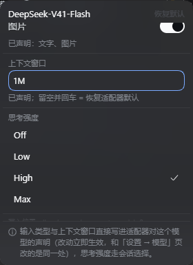
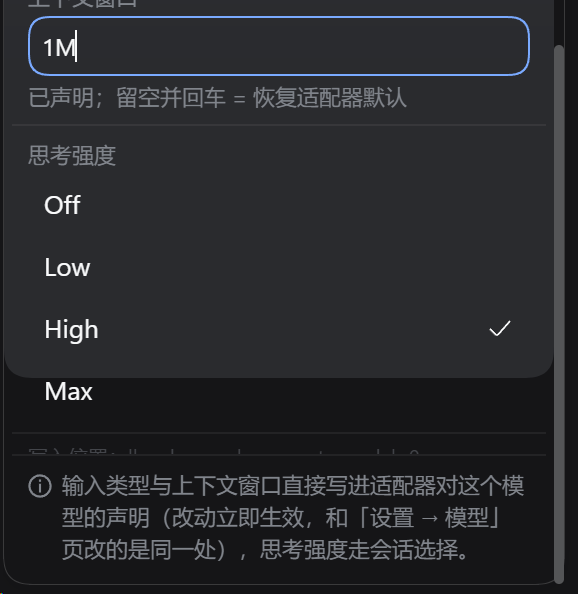

# dsh-model-picker

DSH 输入框右下角模型选择器的**外部替换件**：遮蔽 `conversation.input.model` 座位，
把「Model / Effort 两格 → 各自二级面板」换成**一层列表**——搜索常驻、
每行用**只读徽章**陈述自己的事实（文字 / 图片 / 思考强度 / 上下文窗口）。
**触发器左边还有一个提供商 chip**：选中某个提供商，模型列表就只列它的模型；
提供商菜单里紧跟「全部」还有一项「最近使用」，选中它则只列最近用过的模型（**仍按提供商分组**）。
`/model` 命令弹窗与 Host 侧逻辑一律不动，两者共用同一份选择状态。

- **不改 DSH 安装目录**：只是一个 profile 依赖 + 一个 Loader 行。
- **完全可回退**：删掉那一行（或把 `priority` 改成 `> 0`）即恢复原控件。
- **不复制状态**：目录/当前选择/pending/错误全部读 `ctx.modelDirectories` 提供的同一个
  per-session store，所以任一处切换，另一处立刻同步。
- **筛选只影响视图**：提供商筛选是纯前端状态，不写 Host——`/model` 仍列全部，
  触发器也始终显示真实选择，即使它被当前筛选排除。
- **行内没有控件**：徽章只说事实，点行 = 选模型；**思考强度只在右侧齿轮的参数面板里改**。
- **文字读得清**：面板里每一句真话都过 WCAG AA（最紧的一句 5.64:1），
  由 `npm run contrast` 对着宿主真实令牌表逐个样式量出来——看着"够灰"不等于够亮（见 DESIGN §5.14）。

设计依据、逐条契约核对与实测记录见 [DESIGN.md](DESIGN.md)。

## 效果

| 模型卡（深色，行内事实徽章） | 模型卡（浅色） |
|---|---|
|  |  |

| 提供商筛选（深色） | 参数面板（深色，值来自 Host 声明） |
|---|---|
|  |  |

| 参数面板滚到底（整块卡片都有底色） | 修复前（卡片下半截没有底色，页面透出来） |
|---|---|
|  |  |

| 座位行（提供商 chip · 模型触发器 · 齿轮） |
|---|
|  |

## 行内徽章

每行右侧是四个只读徽章，形态固定、顺序固定。图标为自绘：前三个画在宿主的 16 单位网格上，
思考强度用宿主自己那颗 24×24 大脑（用户指定造型），两套网格各写一份线重、屏幕上都是 1.4px：

| 徽章 | 图标 | 含义 | 值 |
|---|---|---|---|
| 文字输入 | 字母 `T` | 该模型接受文字 | 仅图标；**不支持**时同一图标加斜杠、降到 quiet 色调 |
| 图片输入 | 相框 + 地平线 + 太阳 | 该模型接受图片 | 同上 |
| 思考强度 | 大脑（24×24，宿主同款造型） | 该行生效的档位 | 档位名（`High` / `Off`…，无默认档位时是 `Default`）；模型没声明档位 → 划掉的图标 |
| 上下文窗口 | 窗口（框 + 标题栏 + 内容线） | 该模型声明/默认的窗口 | **整数 + K/M**：`1M` / `128K` / `786K`（不出现 `1048576` 或小数） |

- **胶囊很紧凑**：纯图标胶囊 22px、`Default` 60px、`1M` 41px，常见四枚合计约 151px；
  14px 图标 + 4px 内边距，高度用 `min-height: 22px` 单独声明——**竖向用足行高、横向一寸不浪费**，
  320px 卡片里模型名能分到 ~122px（改版前那次只剩 52.7px，名字显示不下）。详见 DESIGN §5.12。
- **档位名过长只截断自己**：档位名是适配器自由文本，`.dmp-badge-value` 带 `max-width: 64px` + 省略号，
  不会把最后一枚上下文窗口徽章顶出卡片。

- **不猜**：模态与窗口读的是 Host 设置快照（`settings/describe` + `resolveRoute`）。路由不在
  `llm/listConfigurableProviders` 里（例如第三方 provider）或条目+适配器默认都没写这一项时，
  对应徽章**不显示**——不会把"查不到"画成"不支持"。
- **全部信息可读**：徽章条整体带 `title`（鼠标悬停给出整句），整句同时是行的 `aria-label`
  （`"DeepSeek V4.1 Flash，文字输入、图片输入、思考强度 High、上下文窗口 1M"`），
  所以屏幕阅读器读到的不是一串裸数字。
- **不可交互**：徽章用的是宿主的 `Tag` 原语（渲染成 `span`）、外加 `aria-hidden`，
  点徽章等于点该行（选模型），没有任何"点了会改参数"的隐藏行为。

## 交互一览

| 动作 | 结果 |
|---|---|
| 点提供商 chip（模型左边） | 打开提供商菜单：搜索 + `全部 76` / **`最近使用 5`** / `opencode-go 30` / `commandcode 19` …（带模型计数，失败的提供商排在最后且不可选）。**「最近使用」的计数 = 点进去有几行**（列表最多显示 5 条，存储里保留 12 条是为了目录少了模型时列表仍能填满）。**这个会话正在用的那个提供商，行尾标「当前会话」** |
| **选「最近使用」** | 模型列表只列最近用过的模型（最多 5 条），**仍然按提供商分组**（分组头就是现成的那个），所以每行不用重复自己的提供商；卡内提示改为「仅显示最近使用的模型」+「显示全部」。一个提供商被选中过两次就是同一分组里的两行。**排序是 recency**（provider 之间、provider 内部都是），搜索只收窄不重排 |
| 选一个提供商 | 模型列表只列它的模型；卡内出现 `仅显示 {name}` + 「显示全部」；**chip 只回答"列表现在被窄化成了什么"**——菜单勾什么它写什么（未筛选时写「全部」）。这个选择按会话被记住（存储键 `dsh-model-picker.provider.v1:<会话 id>`） |
| 点「显示全部」 | 恢复全部提供商（记忆同时被清掉） |
| 点模型 chip | 单层列表：常驻搜索、provider 分组、每行四个只读事实徽章 |
| 点某行（含行内徽章） | 只切模型（沿用适配器默认强度）；点已在用的行 = 关闭 |
| 悬停某行 | `title` 给出整句事实（模型名、输入类型、强度、上下文窗口） |
| 悬停/聚焦触发器 | 气泡里只有模型名——**强度不再跟在名字旁边**（它是参数，行内徽章陈述它、齿轮面板改它）；屏幕阅读器的名字里仍带着 `推理等级 {effort}` |
| **点模型 chip 右边的齿轮** | 打开**模型参数面板**：输入类型（文字/图片）、上下文窗口、思考强度；当前路由在 profile patch 里有自己的参数时，齿轮带一个小圆点标记 |
| **在参数面板里改「输入类型」** | **真写进 Host**：改的是适配器对这个模型的声明（pi-ai 的 `input`、官方适配器的 `inputModalities`），适配器立即重解析；面板底部写明写入位置（`命名空间 · 路径`） |
| **在参数面板里填「上下文窗口」** | **真写进 Host**：接受 `128K` / `1M` / `262144`；回车或失焦提交，读不出就红框 + 提示并保持原值；**留空 = 撤掉声明，回到适配器默认**（面板会显示那个默认值） |
| **在参数面板里点「恢复默认」** | 把当前模型在这份 profile patch 里的声明撤掉（contextWindow / 输入类型），回到适配器默认；patch 里没有这项时按钮禁用 |
| **在参数面板里点「思考强度」** | **唯一能改强度的地方**：走 `directory.select()` 提交 `{provider, model, reasoningEffort}`，选中标记只跟随 Host 已接受的状态；改完行内徽章同步 |
| 无法寻址的路由 | 模型来自适配器内置目录、你的配置里没有它的声明时，参数面板只能查看并说明原因，行内只留强度徽章（模态与窗口读不到，就不显示） |
| 键盘 | 搜索框 `↑↓` 移高亮、`Enter` 选中；`Tab` 在 提供商 chip → 搜索 → 各行 之间走（行内已无子控件）；`Esc` 逐层退出并归还焦点；参数面板内 `Tab` 在 上下文输入 → 文字 → 图片 → 各强度档 → 恢复默认 之间走、`Esc` 关闭并把焦点交还齿轮 |
| **问答卡片 / 审批卡片 / 只读子代理顶掉输入条时** | **三个弹窗一起关掉**（模型列表、提供商菜单、参数面板）。触发条件不是"卡片出现了"，而是**座位本身离开了版面**——问答卡片并不是唯一会这么做的卡片。关闭时不还焦点：触发器在刚消失的那个盒子里，卡片自己会 `autoFocus` 它的作答控件。详见 DESIGN.md §5.18 |

## 安装

由 DSH 自己写 profile（不要手改 profile 的 `package.json` / `cordis.patch.yml`）：

```
plugin_manager { action: "install_bundle", target: "C:/Users/28529/Desktop/dsh-model-picker" }
```

这条命令做三件事：把包以 `link:` 装进当前 profile、把包名加进 `dsh.profile.bundles`、
应用包内 [`cordis.patch.yml`](cordis.patch.yml) 里那一行 `- insert: [{ id, name }]`。
返回 `application: applied` 即生效；页面刷新后新座位接管（profile 的 HMR 行没有监听本包时，
重建后需要刷新页面）。

**回退**：`plugin_manager { action: "remove_bundle", target: "dsh-model-picker" }`，
或把 `cordis.patch.yml` 里那条 insert 删掉。

## 开发

```bash
npm install          # 仅开发期：esbuild + typescript + @types/react
npm run build        # esbuild → lib/index.js（宿主，空 apply）+ lib/client.js（惰性 CJS + 接线自检）
npm run typecheck    # tsc --noEmit
npm run selfcheck    # 静态禁令 + 座位契约 + 文案键 + 参数面板写入口/滚动契约 + 行内无控件契约 + 触发器/筛选契约
npm run contrast     # 文字对比度门：读宿主令牌表，两个主题下按各样式真实字号判 WCAG AA
npm run test:params  # 参数寻址/容量 + 行内事实推导 + 面板文案决策的单元门（合成快照，不需要浏览器）
npm test             # build + selfcheck + contrast + test:params
```

`npm run contrast` 需要本机装有 DSH（读安装版的 `dsh-client-ui-theme` 令牌表）；找不到时会
`skip` 而不是误报通过。它量的是**两种可能的下层底色**里较差的那种（页面底色与 composer 卡底色），
所以面板浮在哪一层都不会改变结论。

浏览器端验收脚本（对着真实 GUI 跑，页面需已用 `dsh web` 打印的 URL 完成认证）：

```bash
playwright-cli -s=verify open 'http://127.0.0.1:3080/?token=<dsh web 打印的 token>'
playwright-cli -s=verify --raw run-code --filename=./scripts/_accept-anchor-loss.cjs  # §5.18 锚点消失即关闭
```

脚本只读座位的控件与它打开的卡片。`_accept-anchor-loss.cjs` 不写任何配置：它在真实 GUI 上让 Host
自己把输入条隐藏（问答 / 审批卡片就是这么做的），然后断言三个弹窗都关掉了；反向断言窄布局和滚动
**不会**误关。请在一个新会话里跑。

> ⚠ 改了 `src/` 之后 **`location.reload()` 不够**。Loader 用自己算的 `rev` 键给 client 模块，
> 浏览器可以在同一个 URL 下把旧 body 返回来——症状是"服务出去的文本是新的、跑起来的模块是旧的"，
> 和一个没生效的修复一模一样（§5.18 的第一次验收就死在这里）。先把 `Network.setCacheDisabled`
> 设上再 reload，并在记录任何结论**之前**断言服务出去的 bundle 里确实有你的改动。
>
> ⚠ 这个目录下**没有版本控制**（无 `.git`）。批量清理脚本时没有别的副本可退——本轮就有
> 五个既有的浏览器验收脚本被误删（`_verify-settings.cjs`、`_verify-fixes.cjs`、`_icons-probe.cjs`、
> `_badges-probe.cjs`、`_width-sweep.cjs`），只能按 DESIGN.md 里记录的判据重写。

改了 `lib/client.js` 后只要**刷新页面**：宿主按产物哈希把客户端模块拼成
`/plugins/??…dsh-model-picker/client.js&rev=<hash>`，重建后刷新就会取到新文件（实测 `rev` 随重建变化，
新代码里的字符串在刷新后的 bundle 里能读到）。不需要 `remove_bundle` / `install_bundle`。

## 结构

```
src/index.ts               宿主半边：空 apply（行必须存在，行为为空）
src/client/index.ts        入口：inject 声明 + 可选读取 remote.settings / remote.llm + slots.inject → register(priority:-10)
src/client/Picker.tsx      提供商 chip + 触发器 + 齿轮 + 单层菜单（搜索 / 分组 / 行内只读事实徽章）
src/client/BadgeIcons.tsx  四个徽章图标（16 单位网格自绘三个 + 24 单位宿主同款大脑；两套网格各自线重）+ 斜杠"不支持"变体
src/client/facts.ts       徽章词汇表（`BadgeFact`）：渲染层与推导层共用的唯一事实清单，避免两者互相 import
src/client/badges.ts       行内事实推导：resolveRoute + reasoning → 该行能说的 1–4 条事实（纯函数）
src/client/format.ts       徽章专用窗口写法：整数 + K/M（与参数面板可往返的 formatContext 分开，防止被"统一"）
src/client/effort.ts       强度档位的命名与列表（参数面板与徽章共用）
src/client/ProviderMenu.tsx 提供商筛选菜单（搜索 + 计数 + 失败提供商只列不可选）
src/client/SettingsMenu.tsx 模型参数面板（输入类型 / 上下文窗口 / 思考强度 + 写入位置与失败原话）
src/client/panelCopy.ts    面板在每种状态下说哪一句（纯数据：notice / inputHint / contextHint / 字段值与选项）
src/client/anchorLoss.ts   座位什么时候离开了版面：判据、观察对象与二次确认（纯逻辑，可被单元门直接驱动）
src/client/params.ts       参数寻址与读写：describe → resolveRoute → mutate（含 revision 冲突重试）
src/client/recent.ts       全局共享的最近使用（localStorage，去重、上限、只隐藏不删除）+ 「最近使用」伪 provider 与它到 provider 分组的分桶（纯函数，单元门驱动）
src/client/prefs.ts        视图偏好（localStorage，当前只有「按会话记的提供商筛选」，陈旧的 id 由目录判定后丢弃）
src/client/dictionary.ts   zh/en 文案 + 无 locale 服务时的本地兜底
src/client/styles.ts       注入样式表（幂等、可释放；全部走 --dsw-* 令牌）
src/client/contract.ts     外部结构类型（座位面 / 目录 store / 插槽 registry / settings+llm remote / locale 面）
src/client/primitives.d.ts 唯一运行时基线依赖 `@deepseek-ai/dsh-client-ui-primitives` 的类型边界
scripts/build-client.mjs   esbuild 构建 + 接线自检（包裹形状 / id / require 白名单 / 导出 / 座位契约）
scripts/selfcheck-static.mjs 零硬编码色值、无虚线、圆角白名单、两个折叠变量、死类双向比对、ARIA id、座位契约、文案键、写入口契约、行内无控件契约、徽章紧凑预算与图标线重一致、面板滚动/触发器/筛选契约
scripts/check-contrast.mjs 文字对比度门：解析宿主令牌表 → 两种下层底色里较差的那层 → 逐样式按其真实字号判 WCAG AA（令牌与字号都从 styles.ts 读，不硬编码）
scripts/test-params.mjs    参数寻址/容量 + 行内事实推导 + 徽章窗口写法 + 面板文案决策的单元门（esbuild 打包纯函数后在 node 里断言真实 zh 文案）
scripts/mutate-anchor-loss.mjs §5.18 的改坏验证：八条改坏逐条打上、确认静态门变红、改回（改错一条就是门漏了）
scripts/_accept-anchor-loss.cjs §5.18 浏览器验收：三个弹窗各在卡片出现时关闭，窄布局与滚动不误关（真实 GUI）
scripts/_anchor-loss-probe.cjs 复现锚点消失：弹窗从 (265,786.5) 掉到 (12,12) 且滚动不恢复（开发用，只读）
scripts/_squeeze-probe.cjs   窄输入条对座位盒子的压测：证明压到 max-width 0 座位仍是 56×28（开发用，只读）
```

> **本目录没有版本控制**，`scripts/` 下的东西也没有别处副本。2025 年清理临时脚本时，
> `_verify-settings.cjs`、`_verify-fixes.cjs`、`_icons-probe.cjs`、`_badges-probe.cjs`、
> `_width-sweep.cjs` 五个既有的浏览器验收脚本被一并删掉且无法恢复；上面几行以及
> `DESIGN.md` 里对它们的引用是**待重写**的清单，不是现存文件。

## 依赖的外部契约（升级 DSH 后先跑自检）

| 契约 | 为什么关键 |
|---|---|
| `conversation.input.model` 是 `single`、最低 `priority` 渲染 | 本插件靠 `priority: -10` 遮蔽默认 0；同优先级重复注册会抛错 |
| 必须 `ctx.slots.inject(name, cb)` | 插槽由 ui-conversation 声明，注册时机与声明顺序无关 |
| 座位面 `{ available, directory, load, select }`、目录状态字段名 | 直接读注入面，没有中间层 |
| **`remote` + `remote.session` 必须自己 inject** | `directoryFor()` 跑在 Cordis 调用方上下文追踪下，会读 `this.ctx.remote.session`；不声明就从 inject 面抛错，该座位**让位**给原占用者（静默回退，UI 不会坏但也不是你想要的） |
| **`remote.settings` / `remote.llm` 故意不进 inject，用 `ctx.get` 取** | 设置服务在精简/旧部署里可能不存在；把它写进必需注入会让整个座位让位。取不到时面板降级为只能查看并说明，挑选模型本身照常 |
| `llm/listConfigurableProviders` 返回 `{ provider, settingsNs, settingsPath }` | 这是"路由 → 配置位置"的唯一权威映射（与「设置 → 模型」页同一个 join） |
| `settings/describe` 返回每命名空间的 `value` / `user` / `revision` | `value` 是显示的真值，`user`（profile patch）用来判断「这一项是不是你自己声明过」 |
| `settings/mutate(ns, ops, revision)` 只接受 volatile 路径，冲突码 `settings/conflict` | 写入的唯一入口；冲突要重读重试，拒绝要把原话显示出来 |
| 适配器把模型参数声明为 volatile（pi-ai 的 `providers.*` 整块、官方适配器的 `models` 数组） | 非 volatile 路径会被 `settings/mutate` 直接拒绝——本插件只改这两类字段，别的字段不碰 |
| 宿主 `--dsh-composer-model-text-display` / `--…-icon-display` | 窄屏折成图标；不消费就挤爆工具行 |
| **宿主 label 令牌的对比度**：`--dsw-alias-label-caption` 在浅色下只有 2.08:1、`label-dimmed` 只有 1.23:1 | 它们是"最安静的一级"，宿主的表单词旁/禁用态用它没问题，但**不能用来写本插件面板里的说明文字**——`npm run contrast` 就是为这条存在的；图标仍可用 caption |
| **`MenuSurface` 的底色是半透明子元素**（`--dsw-menu-surface-fill` + `backdrop-filter`） | 卡片里所有文字的对比度取决于它**合成到哪一层**：深色下 composer 卡（`--dsw-specific-input-major`）比页面底色暗，同一句红字的对比度会从 4.30:1 掉到 3.61:1。对比度门按两种底层里较差的那层判 |
| 宿主 `Tag` 原语（`tone: neutral / quiet`，渲染成 `span`） | 行内徽章用它，"只读"是结构性的：没有能挂 `onClick` 的按钮位置 |
| 基线模块表（`react`、`react-dom`、`ui-primitives`）隐式外部化 | 不要写进 `dsh.client.external`（`packages/client/AGENTS.md`） |

## 已知边界

- **参数面板里三项都真的生效**，但各走各的门：
  - **输入类型 / 上下文窗口**写进适配器对这个模型的声明：`llm/listConfigurableProviders` 给出 `settingsNs + settingsPath`，
    `settings/describe` 给出当前值与 revision，`settings/mutate` 落盘到 profile 的 `cordis.patch.yml`（和「设置 → 模型」页改的是同一处）。
    前提是**这个路由在你的配置里有声明**（`providers.<provider>.models[i]` 或 `modelOverrides`）：适配器把 `<p>.models` 整块声明为
    volatile，只有 volatile 字段允许这种在线改写，也正因为如此它才是"立刻生效"的。若模型来自适配器内置目录、配置里没有它的条目，
    面板只能查看并说明原因——不会出现一个按了没反应的开关。
  - **思考强度**走会话选择（`directory.select()`）：参数面板是唯一入口，行内徽章只显示它在 Host 那边被接受的值。
  - 写入是**乐观不了**的：面板显示的一切都来自 Host 的 `describe`（reload 后仍是同一份），拒绝时把 Host 的原话显示出来并保持原值；
    revision 冲突会自动重读一次再重试。
- **行内徽章只能说 Host 声明过的事**：模态与窗口来自 `describe`，因此
  - 路由不可寻址（provider 不在 `llm/listConfigurableProviders`，或条目与适配器默认都没写这一项）→ 对应徽章**不渲染**，
    不是画成"不支持"。本机实测就是这样 9 行：`xiaomiMiMo` 6 行 + `WorkBuddy` 3 行（`Hy4 preview · x0.29` 等），
    它们只留一个强度徽章。
  - 强度徽章始终有：模型没有 reasoning 元数据时它是**划掉的**（并说明"未声明思考档位"），
    而不是消失——四个事实里"没有档位"本身就是一条事实。
  - 徽章的句子同时是行的 `aria-label`（徽章条本身 `aria-hidden`），所以屏幕阅读器听到的是
    `"模型名，文字输入、不支持图片输入、思考强度 High、上下文窗口 1M"`，不是一串裸数字。
- **适配器即时重解析**这一点是读代码确认的（`llm-pi-ai` / `llm-deepseek` 都把模型参数声明为 `.volatile()` 并监听
  `loader/volatile-update`；`settings/mutate` 对非 volatile 路径会直接抛错，本插件走的路径没抛），**不是**在 UI 上观测到的
  ——座位的目录（`session/modelCatalog`）至今只发布 `{ provider, model, reasoning }`，看不到窗口和模态。
- **粘性分组头的底色不依赖宿主观察器**：`MenuGroup` 的分组头默认透明、靠
  `observeStickyMenuGroups` 打 `data-stuck` 才填底色，而那个观察器跑在渲染管线里，
  页签在后台/窗口被遮挡时不回调（实测三个观察器零回调），于是滚到粘性头下面的行会和头文字
  叠在一起。官方 ModelSelect 有同样的毛病（摘掉本插件实测确认）。本插件改为给分组头**始终**
  填宿主自己的 `--dsw-alias-menu-group-header-fill`，任何页签状态下都不会重叠；代价是分组头
  一直带着一条 22px 底色带（宿主原意是只在被钉住时才出现）。详见 DESIGN.md §5.8。
- 目录加载失败/部分失败、选择被拒（Toast）、subagent 会话不渲染、`locked` 禁用态、
  pending 菊花这几项已按设计实现，但**未在本机实测**（需要构造故障或特定会话）；
  提供商菜单里「加载失败」的 provider 行同理。
- 强度档位完全来自适配器元数据：模型没有 reasoning 元数据时强度徽章是划掉的（参数面板那一段同样不渲染）。
- 参数面板的**只读分支**（路由不可寻址 / profile 不接受表单编辑 / 部署没挂设置服务）已实现并写进文案，但本机所有路由都可寻址，
  只做了单元层覆盖（`scripts/test-params.mjs`），**未在真实 Host 上构造**。
- 设置快照在座位挂载时读一次、每次写入后用 Host 的返回值更新；如果你在「设置 → 模型」页改了同一个模型，本面板要等下次写入
  或重新开面板才会变（没有订阅 host 的设置推送）。
- 最近使用是全局共享（不按会话隔离），且只记录目录里仍存在的项——不在目录里的记录会被隐藏
  但不会被删除。**列表最多显示 5 条**（`RECENT_VISIBLE`，存储里保留 12 条），菜单里那一行的计数是
  「这个目录现在还能显示多少条」，不是存储总数。**「最近使用」不是 provider**：它是一个保留 id
  （`__recent__`），因为清理陈旧筛选 id 时要拿 id 去和目录的 provider 列表比对，真 provider 撞上这个名字
  就会和它变成同一行。没有任何记录（或记录全都不在目录里了）时，卡内显示「没有可显示的最近使用模型。」，
  chip 仍停在「最近使用」——选择不被静默改掉。
- **提供商 chip 只回答"列表现在被窄化成了什么"**，不回答"这个会话在用哪个提供商"。后者在**提供商菜单里**
  那个 provider 的行尾标「当前会话」。曾经反过来做——chip 未筛选时显示会话实际在用的 provider——结果是
  菜单勾着「全部 ✓」而 chip 写着 `commandcode`，两句话没有一种读法能同时成立。
- **提供商筛选持久化，但只记 id、且按会话隔离**：存在本插件自己的
  `localStorage['dsh-model-picker.provider.v1:<会话 id>']`，刷新页面/重开这个会话后仍是上次那个提供商
  （和「最近使用」同一个存储区，但不共用同一个键）。**不同对话窗口互不影响**——一个窗口里选了什么，
  不会跟着你切到另一个窗口。旧版本用的那个不带会话 id 的全局键在挂载时被清掉。
  目录里**已经不存在的** id 会被自动丢弃（否则会得到一个没有解释的空列表）；失败但仍列在菜单里的
  提供商不会被丢。回到「全部」= 菜单里选「全部」，该会话的存储项同时清掉。筛选本身仍然**只影响视图**
  ——不写 Host、不改 `/model`、不改触发器显示的真实模型。
- 触发器只说模型名：强度是模型参数，行内徽章陈述它、齿轮面板改它，所以不再跟在名字旁边
  （`aria-label` 里仍保留「推理等级 X」，屏幕阅读器不因此少一条信息）。
- **座位离开版面时弹窗会关掉，而不是重新定位。** 三个弹窗都 portal 在 `document.body` 上、
  位置来自锚点矩形，所以 Host 把输入条藏起来（问答 / 审批 / 只读子代理卡片会）时它们本来会留在
  原处不动——面板"成功地"从一个全零矩形算出位置，落到视口左上角 `(12, 12)`，之后再滚动也回不来。
  现在的行为是关掉三个弹窗（不还焦点）。判据是**座位根**有没有盒子，不是单个锚点：
  窄输入条会把 trigger 和 chip 挤到 12px 但座位仍在版面上（实测压到 `max-width: 0` 座位还是 `56×28`），
  所以窗口变窄不会误关。设计理由和实测数据见 DESIGN.md §5.18 / §8.7。

